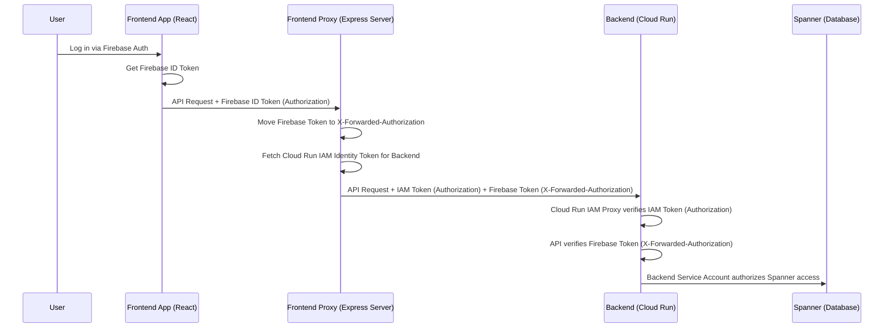

# Google Cloud Authentication with Identity Platform and Cloud Run

<description>
This skill documents the established pattern for implementing a dual-token authentication system across a React frontend, an Express proxy, and a FastAPI backend running on Google Cloud Run. It also covers debugging gotchas and local development practices.
</description>

<triggers>
- Use this skill WHEN asked to implement authentication or login flows.
- Use this skill WHEN integrating a frontend to a GCP backend via Cloud Run.
- Use this skill WHEN asked to troubleshoot 401/403 errors between services.
- Use this skill WHEN setting up Firebase Identity Platform.
</triggers>

<instructions>
1. **Require Dual-Token Authentication:** Ensure the architecture combines Firebase Identity Platform (for authenticating external users via the frontend) and Cloud Run IAM (for service-to-service authorization).
2. **Frontend UI Setup:** The frontend must use Firebase to log users in (e.g., `signInWithPopup`) and attach the Firebase ID Token as a Bearer string in the `Authorization` header of all outbound requests.
3. **Proxy Intermediation:**
    - The Express proxy must receive the request, extract the Firebase token from `Authorization`, and move it to `X-Forwarded-Authorization`.
    - Retrieve a new Cloud Run IAM Identity token automatically using `google-auth-library`.
    - Send the *new IAM token* in the `Authorization` header to the backend.
4. **Backend Validation:** The FastAPI backend relies on Cloud Run infrastructure to automatically validate the IAM token. It must then programmatically validate the user's Firebase token passed in the `X-Forwarded-Authorization` header using `firebase_admin.auth.verify_id_token()`.
5. **Local Development Bypass:** If running locally without a Cloud Run IAM proxy, the proxy should *not* attempt to fetch an IAM token. The local backend must still validate the original Firebase token.
</instructions>

<context>
## Architecture Overview

</context>

<gotchas>
- **Header Case Sensitivity in `google-auth-library`:** When fetching IAM headers via `client.getRequestHeaders()`, the library outputs lowercase keys (e.g., `authorization`, not `Authorization`). If your proxy attempts to read `headers.Authorization`, it will result in `undefined`, stripping the token and causing a 403 Forbidden. *Fix: Always use `headers.authorization`.*
- **IAP & External OAuth Consent Screens:** If you attempt to use Identity-Aware Proxy (IAP) instead of Firebase, setting an OAuth Consent Screen to "Internal" restricts access strictly to users within the GCP Organization (e.g., `@joonix.net`). *Fix: Use Firebase Identity Platform which manages its own identity pool and bypasses internal org restrictions.*
- **Identity Platform Initialization via Terraform:** Simply enabling the Identity Platform API is not enough. You must initialize it with a configuration resource (`google_identity_platform_config`), or Firebase login will throw an `auth/configuration-not-found` error.
- **OAuth Redirect URIs:** Ensure the Firebase authentication handler (`https://<project-id>.firebaseapp.com/__/auth/handler`) is explicitly added to the Authorized Redirect URIs in the Google Cloud Console for the OAuth Web Client ID, otherwise a `400: redirect_uri_mismatch` error occurs during Google Sign-In.
</gotchas>
